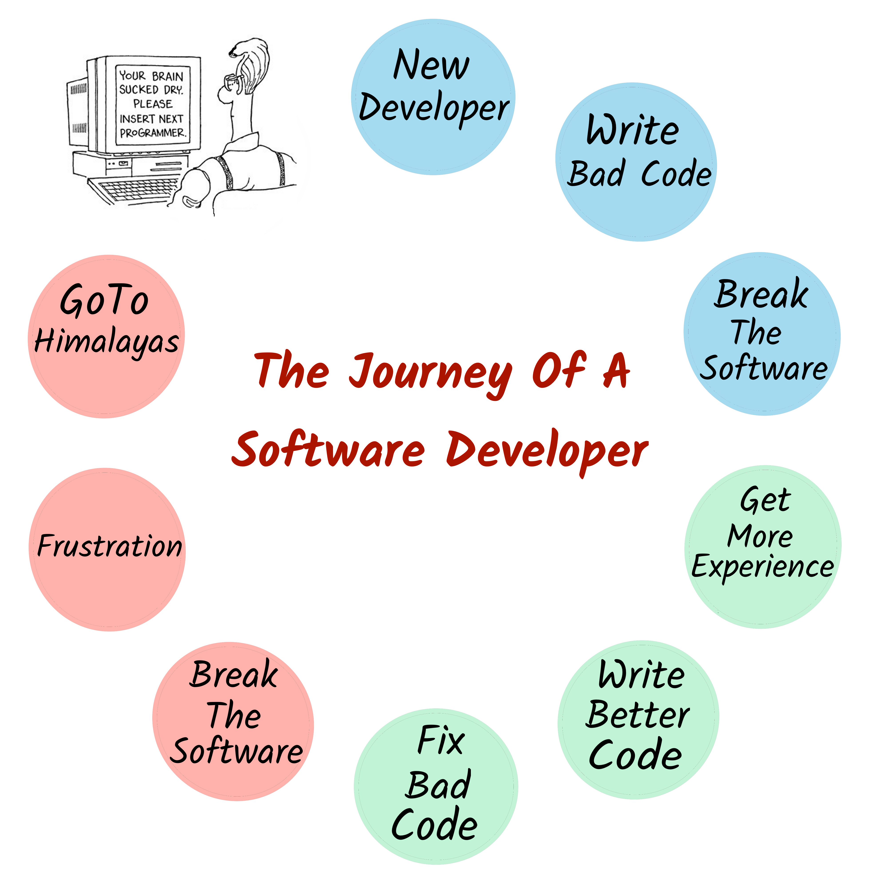

Since you have landed here something tells me you are someone who finds happiness in building something useful out of nothing — someone who is curious and passionate about software development.

However, if there is one word to describe your current state of mind, it would be: **frustrated.**

Frustrated by the mess we are in as [software
developers](https://www.youtube.com/watch?v=lKXe3HUG2l4&t=212s). Frustrated by how hard and slow it is to build a reliable software application. Frustrated by unknowingly inducing bugs in a quest of improving the system. Infuriated by fixing someone else’s mistakes and maintaining the crappy software systems because your manager thinks it is fast and cheap.

Still, you are full of hope, a positive mindset and damn good ideas.

However, maybe you:

* _Have no clue how to start building something and bring your idea to life._
* _Want to learn skills to be a better problem solver without losing your sleep
over it._
* _Wish to know how to build scalable, reliable and adaptable systems from the
start._

No matter where you are currently in your journey, you want to have a **significant** impact. You want to use your intellect and creative ideas towards something that matters, both to you and the world. You want to become more effective and productive problem solver.

You are ready to take your skills to the next level.

However, you don't know how to make that a reality. You feel stuck.

Trust me, my friend. _We've been there too._

Our experiences have made us have some core beliefs as programmers:

- _We believe you have the inherent motivation to learn and build something, it brings you joy and changes people's lives. We'll show you how to do it._
- _We believe you have a great product idea you've kept hidden in the back of your mind for far too long. We're here to teach you skills to bring it into reality in a fast, reliable and cost-effective way._
- _We believe you deserve to be happy and stay relevant in this fast-paced world of technology. We are going to give you the tools to create those feelings in every crevice and cranny of your life._

> **So the gist is: You have product ideas you want to bring to life? We are here to provide you with tools and tutorials to do it faster.**

---

I am your host, [Pragyan Tripathi](https://nerds-den.com/about/), responsible for almost everything on this website. I am obsessed with learning to be a better problem solver and teach students, early-stage software developers and my peers about my findings. I welcome you to hop on with me on this journey of self-improvement.

If you're interested, I specialize in topics like *_software architecture_*, *_databases_*, and *_web application development_*.

**Before I go, I would like to invite you to join my email list community. By signing up (its free), you'll get access to our latest articles right when they come out.**

---

Also thanks for being here. I genuinely appreciate it.
