Over three years, I worked as a Backend Team Lead at [Elanic](https://elanic.in) *(India’s Biggest Community For Buying and Selling).* I learned a lot about software development during these “firey” years of scaling
[Elanic](https://elanic.in) from 3 users in August 2015 to 3 million users in August 2018.

I started with no prior experience in building a production-grade software system. I thought I had a good foundation of programming concepts. How hard could it be? Little that I knew, I am in for lots of sleepless nights and burning myself out in the quest of stabilizing Elanic’s backend system.

> Trying to create new, challenging things is good for society, good for the industry and good for my own life. ~Sachio Semmoto

No other experience could have taught me what I know today. In this article, I share my experiences and the software design lessons I learned the hard way.

### Table Of Contents

1.  [Start With The Data Model](#start-with-the-data-model)
2.  [Separate Your Concerns](#separate-your-concerns)
3.  [Leverage Rule Engines](#leverage-rule-engines)
4.  [Prioritize Software Testing](#prioritize-software-testing)
5.  [There Will Always Be Bugs](#there-will-always-be-bugs)
6.  [Things Will Break](#things-will-break)
7.  [Setup Logging And Error Handling Early](#setup-logging-and-error-handling)
8.  [It Will Take Longer Than You Think](#it-will-take-longer-than-you-think)
9.  [There Are No Coincidences](#there-are-no-coincidences)
10.  [Conclusion](#conclusion)

### 1. Start With The Data Model

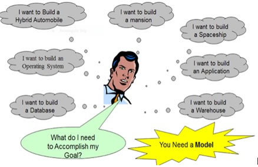

Business people often care about data and concentrate on how this data can be transformed, combined and separated to meet business requirements.

Whereas software developers tend to care about the classes, functions, and processes they are writing.

This mismatch in the thinking process leads to further misunderstanding among business and engineering teams.

[//]: # (To understand the gravity of the problem let’s draw a typical feature request timeline, I went through:)

Six months into my job as a backend developer, I realized I need to understand better business requirements and design system flexible enough to adapt that frequency of change.

Hence, **Data Modelling**.

Data modeling aims to define:

* **The data contained in the database** (e.g., entities: devices, profiles, products, carts, orders, wallets, etc.)
* **The relationships among data items** (e.g., users can create products, profiles can add these products to their cart, etc.)
* **The constraints on data** (e.g., at max only 30 products can be bought together, the user should not be able to use wallet credit if wallet balance becomes less than zero, etc.)

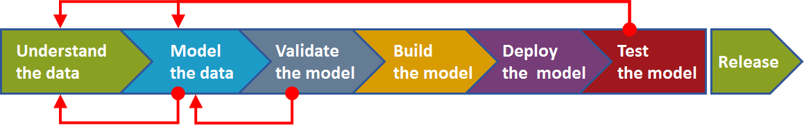

Following data modeling guidelines gave me a clear understanding of business requirements and teams were able to understand and communicate themselves better.

### 2. Separate Your Concerns

When I started backend development in Elanic, the problem we were trying to solve seemed natural. *It’s a social community engaged in buying and selling of lifestyle items.*

It took me seven consecutive sleepless nights to keep the servers running during our growth phase to understand there is nothing natural or straightforward about it.

Once we stabilized the system to sustain the traffic, I realized the whole codebase is the unsustainable mesh of **reads** and **writes** operations.

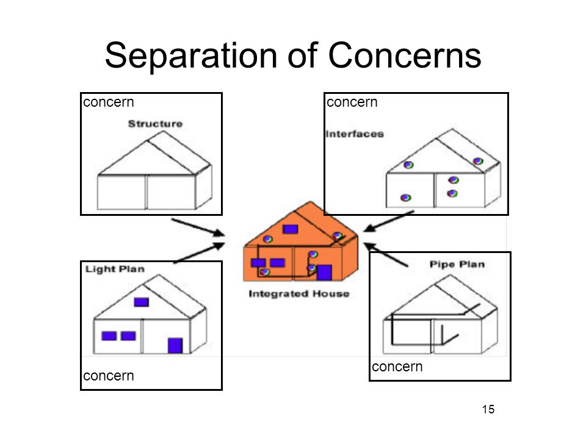

Next month went into a rewrite of the critical sections using proper abstractions — separating read and write operations.

Abstractions are the solutions to general problems. Consider + function. It is a solution to adding numbers in general. Without input arguments, it is quite useless.

Applying these abstractions to a particular set of arguments is a solution to a specific problem.

We often think of software as a solution to a particular issue, like accounting software is the solution to the problem of accounting. An e-commerce website is
a solution to selling online.

But, **it is a bit like kitchen being a solution to cooking**. It doesn’t tell
the whole story. If you open the cabinet, you realize that preparing food is an
extremely complicated process.

It involves solving a lot of smaller problems, like cutting, heating, mixing
ingredients, etc. Our software is the same. It’s hundreds of solutions to lots
of subproblems.

As a software developer, when we develop a new system, **our task is as involved
as inventing a cuisine.** Our tools are much more malleable than steel so that
we can iterate faster, but we still need to fill our arsenal with tools and
develop techniques to select the right one and apply it in the right way.

### 3. Leverage Rule Engines

Once we decided to introduce voucher support in buy-flow of our application. To
do it faster I hardcoded the coupon code and validation logic within the
codebase. Next day onwards, the marketing team kept asking to change the coupon
almost every day, and we kept re-writing the same block of code instead of
moving forward and focusing on other features.

We couldn’t properly test these deployments and ended up providing lousy user
experiences. Later on, similar kind of changes got introduced in deciding
commission, delivery charges, pickup charges, etc. Thankfully, my mentor,
[Abhishek Chauhan](https://www.linkedin.com/in/abhishek-chauhan-625b80a/)
introduced me to rule engines right before I was reaching the limit of my
patience.

*If you are not familiar with business rule engines, you may be wondering why
you would want to use one?*

In most software applications, complex rule processing often takes the form of
nested if-else blocks of code which can be very difficult to interpret and to
maintain.

If rules change *(which they always do)*, a developer must work with a business
person to define the new rule sets. He must then understand the existing
implementation and realize what’s happening to make the required modifications.
These changes must then be recompiled, tested, and redeployed.

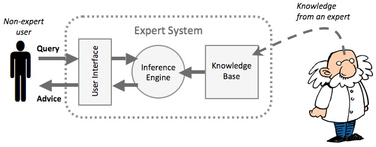

A business rules engine provides a means to separate the rules or logic of an
application from the remaining codebase. Separating these rules offer enormous
benefits.

* *Business rule engines allow the declarative style of programming. Rules define
what should happen, without describing how should it be happening. It makes
codebase much easier to read. Also, it becomes easier to make changes without
introducing bugs.*
* *We can describe these rules in an easy-to-understand language for business
people. It enables business people to validate and even modify rules without
involving software developers.*
* *Also, you don’t need to go through. If your deployment process requires passing
each line of code through a strict workflow of recompilation and testing,
leveraging rule engines can be a huge time saver.*

### 4. Prioritize Software Testing

In an early stage startup, feature requests tend to change so often that writing
automated tests takes a backfoot over manual testing and direct deployments.

It’s not until too late that you realize that the trade-off has been too
expensive.

I won’t suggest you write tests from the start *(ideally you should)*, but at-least write testable code.

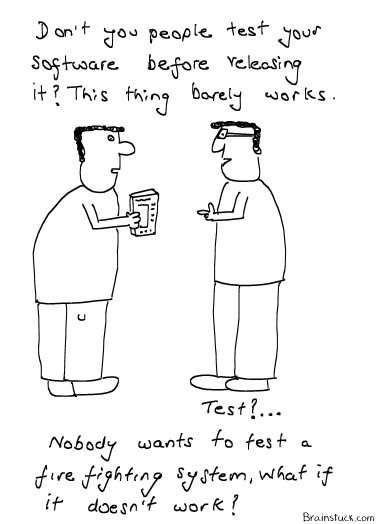

Some people write code in a way that is hard, or even impossible, to write a
good unit test for it. **So, what makes the program hard to test?** Let’s review
some bad-practices and code smells developers must avoid when writing testable
code.

#### Uncontrolled Non-Determinism and Side Effects

Methods with non-deterministic behavior and side-effects lead to deceptive, hard
to understand, non-reusable, tightly coupled, and untestable code. They tend to
have destructive effects on your codebase.

On the contrary, functions that are both deterministic and free of side-effects
are much easier to test, reason about, and reuse to build more extensive
programs. In functional programming, these methods are called pure functions. To
test them you just need to pass required input arguments and check the result
for correctness.

#### Impurity is toxic

What makes code hard to test is hard-coded context driven values which may
change anytime. These impurities are hard to replace, override, or abstract away
in some other way.

If method `Foo()` depends on non-deterministic method `Bar()`, `Foo() `becomes
non-deterministic as well. Eventually, it ends up poisoning the entire system.
Multiply all these problems by the size of a real-life software application, and
you’ll find yourself entangled with a hard to maintain codebase, full of
anti-patterns, secret dependencies, and all sorts of ugly and unpleasant things.

### 5. There Will Always Be Bugs

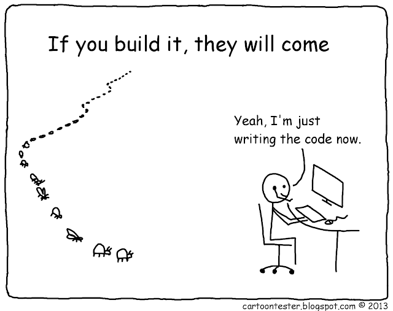

Straight out of college, I was a software developer striving for perfection. Any
bug in my code frustrated me to the core. I wanted my work to be flawless, like
a clockwork, yet bugs appeared.

It took me two years of professional experience to understand the reality:
**there will always be bugs.**

I learned to change my attitude toward software development — aiming for
excellence instead of perfection.

I learned the phrase **“get it right the first time”** doesn’t exist in software
development. No matter how much effort you make, bugs will always find a way to
crop up.

Bugs pretty much can be defined as **“that didn’t cross our minds.”**

If you want to ensure impeccable software quality, write less code that does
less stuff, and then spend a lot of time honing that piece of code. However, it
is not a realistic course of action to take.

You need to understand that bugs are an unavoidable byproduct of software
development. Instead of trying to eradicate software bugs once and for all, you
should focus on building a system that lets you quickly troubleshoot the
problems, fix the bugs, and deploy the fixes.

Software developers need to understand — the absence of bugs is merely one
parameter for software’s success, but not even close to the most important one.

**Usefulness.** A useful software trumps a bug-free software anytime. The value
of software depends far more upon the problem it solves than the quality by
which it does so.

### 6. Things Will Break

Software development is a process. It’s always evolving, never really finished.
Today your software sucks, my software sucks, we all are writing shitty
software. With bugs! But it’s shipping! Next time we will do better.

Today you improved the **application layer** of your software system and
resolved all the issues. Next day you will realize the problem in the **database
layer** has brought the whole system down. Once that is fixed, your
**infrastructure layer** will disappoint you.

The cycle will keep repeating. **Things will always be breaking.**

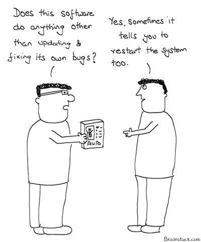

The unhappy stakeholders or customers will mock you for this. Validate their
belief that you’ve let them down. *I agree what we wrote isn’t perfect. We won’t
argue with you on that. Promise to look at their problems, and if possible fix
it in next release.*

I have realized the best way to learn software design is to break it. It doesn’t
mean that you should start ripping through a stable codebase and start rewriting
is as an exercise.

Start by breaking off a small piece. Do we even need this function? What happens
if we remove this variable? Be curious about how it all works, and fix it.

While learning to be good at software development, controlled destruction breeds
confidence. The most direct way to improve as a software developer is to be
fearless when it comes to changing your code. Software developers who are afraid
of a broken system are developers who will never mature into professionals.

### 7. Setup Logging And Error Handling Early

When developing a new software system, one of the first things you must do is
add logging and error handling, because both are useful from the very beginning.

For all software systems that are bigger than a handful of lines of code, you
need some way of knowing what happens in the program.

Perhaps not when it is working as expected, but as soon as it doesn’t, you must
be able to see what’s happening.

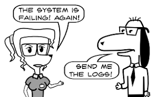

The same goes for error handling — errors and exceptions happen in the beginning
too, so the sooner you systematically handle them, the better.

### 8. It Will Take Longer Than You Think

**Have you ever made a wrong estimate?**

According to Daniel Kahneman’s research in the book [Thinking Fast and
Slow](https://amzn.to/2VVgk7y), there is a fair chance you would say yes.

We are all bad at estimating. The reason why we are worse in estimates is that
we don’t seem to understand what they are. We don’t know what they are supposed
to be. We don’t see why we do them. We don’t know how to do them.

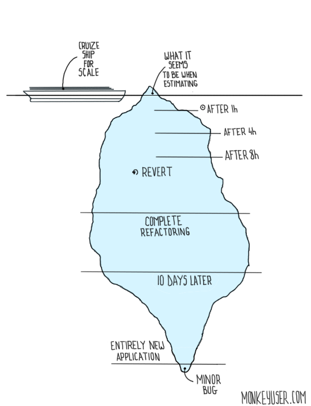

The problem with estimates is that they breed mistrust. Once you give an
estimated deadline, it immediately transforms into a contract and commitment.
Then you miss it!

**Have you ever missed an estimate?**

When you miss an estimate, the stakeholders assume that it was a commitment of
some kind and you are not trustworthy.

Let me give you my example of making a terrible estimation:

The early backend system of Elanic was written using PHP and MySQL. When I
discussed with founders, they painted a beautiful picture of the scale we would
be handling.

There is going to be a multitude of social interactions, buying & selling of
items, logistics tracking, feeds engagements, etc. We need to build a system
which could handle such features and the scale of millions of users.

My job was to migrate it to a new stack using NodeJS, MongoDB, and Elasticsearch
along with maintaining the current system. I brainstormed the new software
architecture and presented it.

My boss asked how long is it going to take? Well, it is a few API calls to
write. Four weeks and we would be ready to launch.

We launched the new backend twelve months later. That was 12X of what was
estimated.

The problem seemed straightforward in the start. But I could not have known the
issues without actually deep diving and trying to solve them.

I learned it is effortless to give an estimate for a project deadline. But it is
tough to hit it precisely.

Even as of today most of my projects take **three times longer** than the time I
forecast.

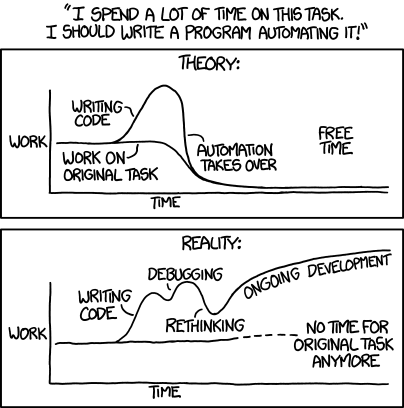

There are so many external factors involved, communicating the requirements
effectively, a simple merge turns out to be the cause of a catastrophic bug, or
an API call doesn’t work as promised, etc. It is quite common to run into
unexpected problems.

### 9. There Are No Coincidences

Startups are really good at creating what I call **“Fake Urgencies.”** People
will come to you and say something like *“if we don’t do this by tomorrow, we
are doomed.”*

As programmers, we’re under constant pressure to deliver code quickly. The most
important lesson I learned in the last three years is “haste always makes
waste.”

You should always take time to think about risks involved throughout the whole
process.

**Good software design is not an accident, it is the result of meticulous
planning and leveraging exceptional programming skills.**

Never believe in coincidences, when you are developing a new feature, or fixing
bugs. You committed a bug fix, and an independent service becomes unavailable?
Not an accident.

Ignoring such occurrences, and not spending time investigating the issue may
bring the whole system down. In some cases make you lose your sleep and mental
sanity.

### Conclusion

If you made it till this section, CONGRATULATIONS!. I thank you for your
commitment. I hope you feel less anxious after reading my experiences

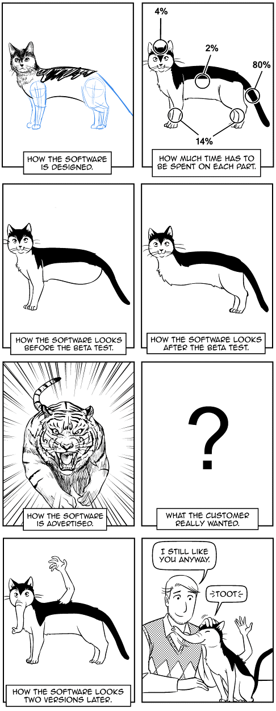

If I would like you to take in one lesson from my experiences in the post it’s
going to be:

*Software development is hard work. A clear codebase and flexible software
architecture is no accident. Very few programs come out right the first time or
even the third time. Remember this in moments of despair. If you find that
building reliable, scalable, and flexible software application is hard, it’s
because it is hard.*

### We 💚 your feedback

In this post, I shared the lessons I learned while working for an early stage
startup. If you have had such experiences while working as a software developer,
Comment Below! You can also share your feedback through
[Github](https://github.com/vadelabs/nerdsden/issues) or Slack

### References and Further Reading

1.  [MongoDB Data Modeling](https://amzn.to/2AyCQKk)
